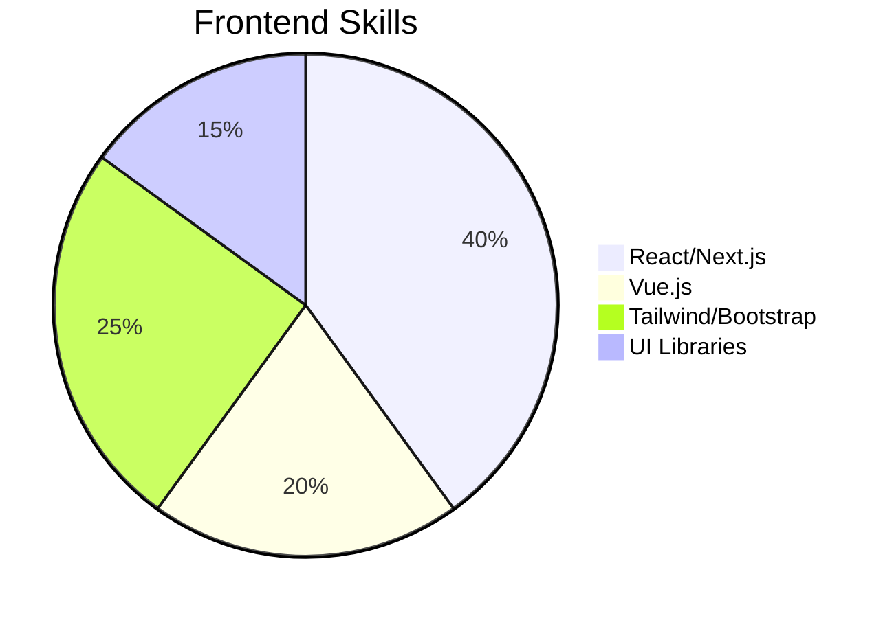
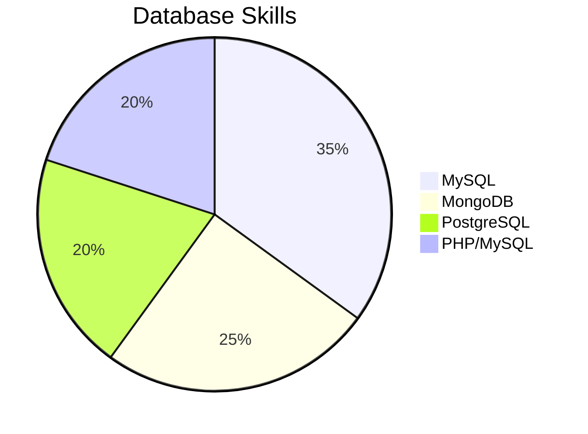
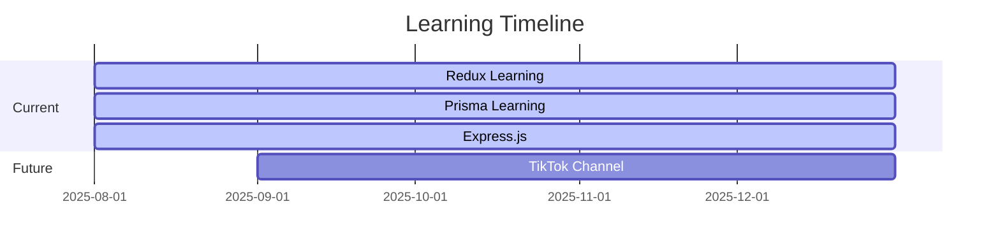

# 👋 Hello, I'm Magdy Jacob Wassaf

  

## 🚀 About Me

I'm a passionate **Frontend Developer** with 2+ years of experience specializing in **Next.js** and modern web technologies. I love building scalable applications and solving complex problems with clean, efficient code.

### 🎯 Current Focus

- Working on **HR Management System** for **ENSRV** company in Qatar
- Learning **Redux**, **Prisma**, and **Express.js**
- Preparing to launch **TikTok channel** for tech content

---

## 🛠️ Tech Stack & Skills

### 💻 Programming Languages

### ⚛️ Frontend Frameworks

### 🎨 UI Libraries & Frameworks

### 🗄️ Databases

### 📊 Additional Tools

---

## 📈 GitHub Stats & Activity

  
  

  

---

## 🏆 Skills Breakdown

### Frontend Development

### Database & Backend

### Learning Progress

---

## 💼 Professional Experience

### 🏢 Current Position

- **Frontend Developer** at **ENSRV** (Qatar)
- **HR Management System** - Full-stack development
- **Freelance Developer** - Various client projects

### 🎯 Project Types

- **HR Management Systems** ⭐
- **E-commerce Platforms**
- **Portfolio Websites**
- **CRUD Applications**
- **Reporting Systems**

---

## 🎯 Career Goals

### Short-term Goals

- Join a **reputable tech company** that values growth
- Work with **senior developers** to enhance skills
- Build a strong **professional network**

### Long-term Vision

- **Found my own E-commerce company**
- Become one of the **largest tech companies** in the region
- **Mentor and inspire** the next generation of developers

---

## 🌟 Leadership & Soft Skills

### 👥 Team Management

- **Managing 2 teams** of people
- **Quality inspection team** leader
- **Educational content team** for children

### 🎮 Personal Interests

- **Gaming** enthusiast
- **Chess** player
- **Project management** skills
- **Driving** and leadership

---

## 🌍 Languages & Communication

- **Arabic** 🇪🇬 - Native
- **English** 🇺🇸 - B2 Level

---

## 📱 Connect With Me

  
  
  

---

## 🚀 Featured Projects

  
  
  

---

  
  
  ### 🎯 Ready to build amazing things together!
  
  *"Code is like humor. When you have to explain it, it's bad."* - Cory House

